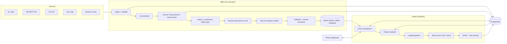
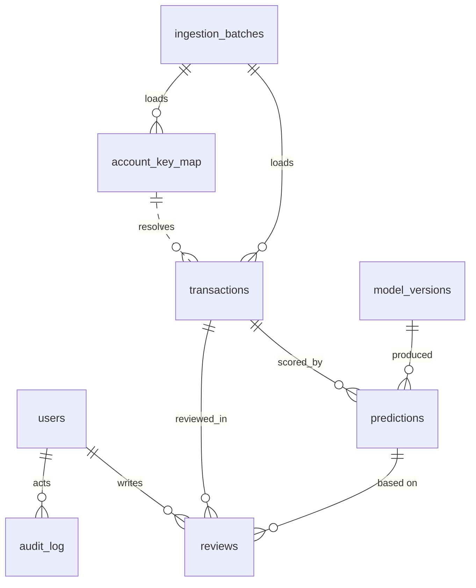
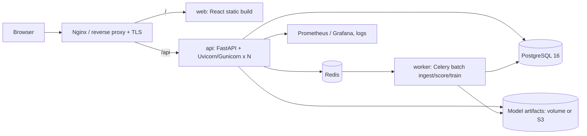

# Transaction Fraud Detection & Risk Scoring — System Architecture

Version 1 · 2026-09-30 · Design only (no application code yet)

---

## 0. What the data actually contains (read this first)

The design is shaped by a profile of the uploaded files, so this section comes before the architecture.

**Source files**

| Source | Format | Columns | Rows (Jun / Jul / Aug 2026) |
|---|---|---|---|
| GL (General Ledger) | XML | TransactionID, gl_account_id, TransactionDate, Amount, Currency, Country, Description | 16,824 / 21,908 / 22,105 |
| MA (Management Accounting) | REST API (Flask server per month; data embedded as a compressed CSV) | same minus gl_account_id, plus ma_customer_key; Amount is a string | 16,824 / 21,844 / 22,039 |
| FA (Financial Accounting) | CSV | same minus gl_account_id, plus fa_key | 16,824 / 21,862 / 22,019 |
| Join map | TXT (CSV) | gl_account_id, ma_customer_key, fa_key, entity, effective_from, effective_to | 3,204 / 7,062 / 6,815 |
| Business rules | pipe-delimited TXT | R01–R10 real rules (formats, amount 0–100k, currency/country lists, keys, SUM by account); R11–R25 placeholders | — |

**There is no fraud label.** The use-case PDF ("OneRecon") is a *reconciliation* problem: the same transaction is recorded in GL, MA and FA, and the job is to find **breaks** (records that disagree or are missing). So the design derives the target label from the data:

> **`is_suspicious = 1`** when a transaction is missing from any system, its amount / date / currency differs between systems, its account has no valid key mapping, or it violates a business rule (negative amount, > 100,000, date outside the period).

Result of applying that definition (outer join on TransactionID across the 3 systems):

| Month | Transactions | Suspicious | Rate | Main types |
|---|---|---|---|---|
| June | 16,824 | 0 | 0.0% | clean baseline |
| July | 21,987 | 841 | 3.8% | amount 340, missing 347, date 125, currency 112, rule 81 |
| August | 22,258 | 2,096 | 9.4% | amount 1,026, missing 611, rule 369, date 261, currency 195, account not in join map 194 |

Two findings drive the ML design:

1. **Heavy class imbalance** (0–9%), and the rate rises month to month, so the pipeline needs imbalance handling, PR-AUC as the headline metric, and a time-based validation split.
2. **Single-system attributes do not predict breaks.** The rate is flat (5–7%) across currency, country, description, weekday and amount band, and an account that broke in July is *not* more likely to break in August (8.2% vs 9.6%). The signal lives in **cross-system deviation features** (amount delta between systems, missing counterpart, key-map mismatch) plus rule violations. Behavioural per-account features are still built, because they matter for real fraud data and for scoring new transactions, but they are expected to add little here, and an ablation study will show it.

The pipeline is written so the label definition is a pluggable module: if a labelled fraud dataset (e.g., a column `is_fraud`) is supplied later, only the labeller and the feature config change.

---

## 1. Project modules

| # | Module | Responsibility | Maps to requirement |
|---|---|---|---|
| M1 | **Ingestion** | Adapters for XML, CSV, REST API (paginated MA), XLSX/JSON uploads, join map; validate against business rules; write raw + canonical records | 1, 10 |
| M2 | **Canonicalisation & linking** | One canonical schema; normalise types (MA amount string → decimal); link the three system records per TransactionID; resolve keys through the effective-dated join map | 1 |
| M3 | **Labelling** | Derive `is_suspicious` and `break_type` (multi-label) from linked records; pluggable for a true fraud label | 2 |
| M4 | **EDA & reporting** | Notebooks + generated HTML report: distributions, break patterns, correlations, per-month drift | 2 |
| M5 | **Feature engineering** | Cross-system, rule, behavioural and anomaly features, computed point-in-time (no leakage); shared by training and serving | 3 |
| M6 | **Model training & selection** | Train and compare Logistic Regression, Random Forest, XGBoost/LightGBM, Isolation Forest; tune; calibrate; pick champion | 4, 5 |
| M7 | **Risk scoring & explainability** | Calibrated probability → 0–100 score → band; SHAP top factors + rule hits → human-readable reasons | 6, 7 |
| M8 | **Model registry** | Versioned `joblib` pipeline + metadata + metrics; active-model pointer in DB | 8 |
| M9 | **API (FastAPI)** | Scoring, transactions, analytics, models, ingestion, auth, review workflow | 9, 12 |
| M10 | **Persistence (PostgreSQL)** | Transactions, links, predictions, explanations, reviews, audit | 10 |
| M11 | **Frontend (React)** | Dashboard, scoring form, history, analytics, model page, review queue | 11, 12, 13 |
| M12 | **Ops** | Docker, CI/CD, config/secrets, logging, monitoring, drift checks | 14 |

---

## 2. Folder structure

```
fraud-risk-platform/
├── README.md                       # setup, run, architecture, assumptions
├── docker-compose.yml              # postgres, api, web, (redis, worker)
├── docker-compose.prod.yml
├── .env.example                    # no secrets committed
├── Makefile                        # make train / test / up / migrate
├── .github/workflows/ci.yml
│
├── data/                           # git-ignored
│   ├── raw/{202606,202607,202608}/ # untouched source files
│   ├── interim/                    # canonical parquet per system/month
│   └── processed/                  # linked + labelled + features parquet
│
├── ml/                             # offline ML package (pip-installable: fraudml)
│   ├── pyproject.toml
│   ├── fraudml/
│   │   ├── config/                 # features.yaml, models.yaml, rules.yaml
│   │   ├── ingest/                 # gl_xml.py, fa_csv.py, ma_api.py, join_map.py, rules.py
│   │   ├── canonical/              # schema.py, normalise.py, link.py
│   │   ├── labels/                 # break_labeller.py, fraud_labeller.py (pluggable)
│   │   ├── features/               # cross_system.py, rule_features.py,
│   │   │                           # behavioural.py, anomaly.py, build.py
│   │   ├── models/                 # candidates.py, tune.py, calibrate.py, select.py
│   │   ├── scoring/                # risk_score.py, bands.py
│   │   ├── explain/                # shap_explainer.py, reason_codes.py
│   │   ├── evaluation/             # metrics.py, plots.py, report.py
│   │   └── pipeline.py             # CLI: ingest → label → features → train → register
│   ├── notebooks/                  # 01_eda.ipynb, 02_features.ipynb, 03_models.ipynb
│   ├── reports/                    # generated EDA + model comparison HTML
│   ├── artifacts/                  # model_v{n}.joblib + metadata.json (git-ignored)
│   └── tests/
│
├── backend/
│   ├── pyproject.toml
│   ├── alembic/                    # migrations
│   ├── app/
│   │   ├── main.py                 # app factory, lifespan loads rules + model
│   │   ├── cli.py                  # fraudapi create-user / ingest / sync-models
│   │   ├── core/                   # config.py (pydantic-settings), security.py, logging.py, errors.py
│   │   ├── db/                     # session.py, base.py
│   │   ├── models/                 # SQLAlchemy ORM tables
│   │   ├── schemas/                # Pydantic request/response models
│   │   ├── repositories/           # transaction queries and filters
│   │   ├── services/               # scoring, ingestion, analytics, reviews,
│   │   │                           # models, users, audit
│   │   ├── ml/                     # registry.py (model versions), frames.py (rows <-> fraudml frames)
│   │   └── api/v1/                 # auth, users, transactions, predictions, analytics,
│   │                               # models, ingestion, reviews, reports, audit, health
│   └── tests/                      # API tests against PostgreSQL (positive & negative)
│
├── frontend/
│   ├── package.json
│   ├── vite.config.ts
│   └── src/
│       ├── api/                    # typed client (generated from OpenAPI)
│       ├── components/             # RiskGauge, FactorBars, KpiCard, charts/
│       ├── pages/                  # Login, Dashboard, Score, Transactions,
│       │                           # TransactionDetail, Analytics, Models,
│       │                           # Reviews, Ingestion, Admin
│       ├── hooks/  store/  routes/  utils/
│       └── tests/
│
└── infra/
    ├── nginx/nginx.conf
    ├── docker/{api,web,worker}.Dockerfile
    └── terraform/ (optional, cloud)
```

The ML code lives in its own package (`fraudml`) and the backend imports it, so the **exact same feature code runs in training and in serving**. This is the single most important guard against training/serving skew.

---

## 3. Data flow



**Offline (training) path.** Raw files → validated canonical records (stored in Postgres and as Parquet) → linked cross-system view → labels → features → models → registry.

**Online (scoring) path.**

1. The user submits a transaction from the UI (or a system posts one).
2. The API validates it with Pydantic and runs the business rules.
3. It stores the record in `transactions`, then looks up counterpart records for the same TransactionID in the other systems, plus the account's history.
4. The feature adapter builds the same feature vector as in training.
5. The pipeline returns a probability, which is calibrated and scaled to a 0–100 score with a band.
6. The explainer returns the top factors, and everything is written to `predictions`.
7. The UI shows the gauge, band and reasons.

**Batch path.** When a month of files is uploaded, it is ingested, linked and scored in a background job, and dashboards refresh from the DB.

---

## 4. ML pipeline

### 4.1 EDA (notebook + auto-generated report)
- Record counts per system per month, missing-in-system matrix (Venn/UpSet)
- Break rate by type, month, currency, country, description, weekday, amount band (expected: flat)
- Amount distributions per system; delta distributions (relative amount delta has median 7%, p90 520%)
- Rule violation counts (R01–R10); join-map coverage and effective-date checks
- Account-level: transactions per account (median 6), repeat-break accounts (371 in Jul+Aug)
- Drift between months (PSI on amount, currency mix)

### 4.2 Features (defined in `features.yaml`, computed by `fraudml.features.build`)

| Group | Features | Expected value on this data |
|---|---|---|
| **Cross-system presence** | in_gl, in_ma, in_fa, n_systems_present | High |
| **Cross-system deviation** | abs/rel amount delta GL–MA, GL–FA, MA–FA; max_rel_delta; sign_flip; date_delta_days (max pair); currency_mismatch; n_fields_mismatched | High |
| **Key integrity** | gl_acct_in_join_map; ma_key_matches_map; fa_key_matches_map; mapping_effective_on_date | Medium–high |
| **Rule features** | n_rule_violations; amount_negative; amount_over_limit; date_outside_period; format violations per rule | High |
| **Behavioural (per account, only prior data)** | txn_count_7d/30d; mean/std/max amount 30d; amount_zscore_vs_account; amount_ratio_to_account_max; minutes_since_last_txn; same_day_txn_count; is_new_currency_for_account; is_new_country_for_account; distinct_currencies_30d; prior_break_count; prior_break_rate | Low here, important for real fraud |
| **Transaction attributes** | amount, log_amount, is_round_amount, currency, country, description (one-hot / target-encoded), day_of_month, is_month_end, weekday | Low here |
| **Anomaly** | isolation_forest_score (fit on June clean baseline) | Medium |

Leakage controls: behavioural windows use only transactions strictly earlier in time. Features are fit inside a scikit-learn `Pipeline`/`ColumnTransformer` so scaling and encoding are learned on training folds only.

### 4.3 Training & model comparison

- **Split:** June is all-negative, so train on **June + July**, then validate on a stratified 20% hold-out of that data for tuning. The final **out-of-time test is August**, which mirrors production: train on the past, score the new month. A second view uses 5-fold stratified CV on Jul+Aug.
- **Candidates:**
  1. Logistic Regression (class_weight=balanced), the interpretable baseline
  2. Random Forest
  3. XGBoost or LightGBM with `scale_pos_weight`, the expected champion
  4. Isolation Forest (unsupervised), used both as a comparison and as a feature
  5. Optional: SMOTE + LightGBM via imbalanced-learn, to test whether oversampling helps
- **Tuning:** Optuna, optimising PR-AUC, with a small trial budget per model.
- **Metrics:** PR-AUC (primary), ROC-AUC, recall at a fixed precision (e.g., recall@P=0.9), F1 at the chosen threshold, Brier score (calibration), and per-break-type recall. A comparison table and plots are written to `ml/reports/model_comparison.html`.
- **Ablation:** a model with only behavioural + attribute features versus the full feature set. This quantifies the finding in section 0 honestly.
- **Tracking:** MLflow (local file store) logs params, metrics and artifacts per run.

### 4.4 Probability → 0–100 risk score
1. **Calibrate** the champion with isotonic regression (or Platt if data is small) on the validation fold, so that 0.8 means ~80% of such transactions are suspicious.
2. **Score** = `round(100 × p_calibrated)`.
3. **Rule floor:** hard rule violations (e.g., amount > 100k or missing from a system) set a minimum score, so `score = max(model_score, rule_floor)`. This keeps obvious breaks from being under-scored.
4. **Bands** (thresholds stored with the model and tunable):

| Band | Score | Action |
|---|---|---|
| Low | 0–39 | auto-clear |
| Medium | 40–69 | queue for review |
| High | 70–89 | priority review |
| Critical | 90–100 | immediate alert |

The PDF also asks that breaks be prioritised by materiality, so the API returns a separate **priority** = risk score × materiality weight (amount delta in USD-equivalent), which the review queue sorts by. This avoids biasing the risk score itself by amount or entity size, in line with the PDF's ethical-AI guardrail.

### 4.5 Explanations
- **SHAP TreeExplainer** on the champion gives per-feature contributions. The top 3–5 positive contributors are kept.
- **Reason-code templates** turn features into plain sentences, for example:
  - "MA amount differs from GL by 412% (73,092.01 vs 374,233.10)."
  - "Transaction missing from FA."
  - "Account ACC4412 has no mapping in the August join map."
  - "Amount is 3.8× this account's 30-day maximum."
- Rule hits are listed separately (rule id + message), so users can tell deterministic checks apart from model signals.
- A predicted **break type** (multi-label head, or derived from the top contributing feature group) gives a root-cause hint, as the PDF requests.

### 4.6 Saved pipeline
One `joblib` artifact per version contains the preprocessing `ColumnTransformer`, the model, the calibrator, the SHAP background sample, the feature list and dtypes, the band thresholds and the rule floor config. It is paired with `metadata.json` holding the version, training data hash, date range, metrics, library versions and git SHA. The artifact is registered in the `model_versions` table, and exactly one version is `is_active`.

---

## 5. Backend architecture (FastAPI)

```
Request → Router (api/v1) → Service → Repository → PostgreSQL
                              │
                              └→ ML adapter (fraudml features + loaded pipeline)
```

- **Layers:** routers only handle HTTP and validation. Services hold the business logic (scoring, ingestion, analytics, review). Repositories hold SQL (SQLAlchemy 2.0 with sync sessions on psycopg 3; FastAPI runs the sync endpoints in its thread pool, and the pandas scoring code is sync anyway). The model registry loads the active artifact in the `lifespan` hook and checks the active version in the database on every scoring call, so all workers follow an activation without a restart.
- **Validation:** Pydantic v2 schemas check structure and types (TransactionID pattern, system names, ISO dates, numeric amounts, 3-letter currency). Malformed input returns 422 with field messages. Business-rule breaches (R01–R25) are not rejected: they are scored as a `rule_violation` break with its reason, because a breach is what reviewers need to see. The same labeller runs on single submissions and month loads.
- **Auth:** JWT (OAuth2 password flow, PyJWT HS256), bcrypt hashes, and roles `analyst` (investigator), `approver` and `admin`. This gives the PDF's maker-checker: analysts submit a finding, approvers confirm or reject it, and nobody can decide their own review.
- **Background work:** FastAPI `BackgroundTasks` for the MVP (month uploads return 202 and a batch id to poll). Batch ingestion and scoring move to **Celery + Redis** once files get large.
- **Cross-cutting:** structured JSON logging with a request id (also stored on audit rows), a global exception handler, and CORS locked to the frontend origin. Rate limiting on `/predictions` and a `/metrics` Prometheus endpoint are planned for the deployment step.
- **Config:** `pydantic-settings` reads env vars (DB URL, JWT secret, model path). No credentials live in code.
- **Performance target:** single scoring < 100 ms p95. Account history lookups use indexed queries on `(gl_account_id, transaction_date)`. Measured in step 4: 0.3–0.6 s per single transaction (pandas overhead in the shared feature code) and about 20 s to load and score a month of 22k transactions. Closing the single-call gap is a follow-up.

---

## 6. Database schema (PostgreSQL)



| Table | Key columns | Notes |
|---|---|---|
| `users` | id, email, full_name, password_hash, role (analyst/approver/admin), is_active, created_at | |
| `ingestion_batches` | id, period (YYYYMM), method (file/api/cli), status, files JSONB, records JSONB (rows read per system), summary JSONB, transactions_loaded, transactions_scored, error, duration_ms, created_by_id, started_at, finished_at | PDF asks to record method, count and time |
| `account_key_map` | id, period, gl_account_id, ma_customer_key, fa_key, entity, effective_from, effective_to, batch_id | join map, per month; a reload replaces the month |
| `transactions` | id, transaction_id UNIQUE, period, source (batch/api), batch_id; per system `in_*` and `{account_key, transaction_date, amount, currency, country, description, rule_violations}_{gl,ma,fa}`; coalesced gl_account_id, transaction_date, amount, currency, country, description; expected_ma_key, expected_fa_key, gl_account_mapped; is_suspicious, break_types JSONB; latest risk_score, risk_band, probability, exposure_usd, priority, model_version, scored_at; review_outcome | one linked row per TransactionID, holding each system's record side by side; a late system's record is merged in and the row re-scored |
| `model_versions` | id, version, algorithm, artifact_path, features JSONB, threshold, metrics JSONB, train_periods, test_period, details JSONB (full metadata, incl. evaluation curves), is_active, trained_at | one active version (partial unique index) |
| `predictions` | id, transaction_pk FK, model_version_id FK, probability, model_score, risk_score, risk_band, exposure_usd, priority, break_types, rule_hits JSONB, top_factors JSONB, source (api/batch), latency_ms, created_at | history kept; the latest is copied onto the transaction |
| `reviews` | id, transaction_pk FK, prediction_id FK, analyst_id, decision (confirmed/false_positive), note, status (pending/approved/rejected), approver_id, approver_note, decided_at, created_at | maker-checker; one open review per transaction (partial unique index); approved outcomes are meant to feed retraining (not wired yet) |
| `audit_log` | id, user_id, action, entity, entity_id, before JSONB, after JSONB, request_id, created_at | append-only |

Indexes cover `transactions(gl_account_id, transaction_date)`, `transactions(period, is_suspicious)`, `transactions(priority)`, `transactions(risk_band)`, a GIN index on `transactions(break_types)`, `predictions(transaction_pk, created_at)`, `predictions(risk_band, created_at)` and `reviews(status, created_at)`. The latest score lives on `transactions`, so dashboard queries read one table. A materialised view (`mv_daily_risk_stats`) is only needed if those queries get slow; it is not built yet.

---

## 7. API endpoints (`/api/v1`)

| Method | Path | Purpose | Role |
|---|---|---|---|
| POST | `/auth/login` | Get JWT | public |
| GET | `/auth/me` | Current user | any |
| GET · POST · PATCH | `/users` · `/users/{id}` | List, create, change role or deactivate users | admin |
| GET | `/health` · `/ready` | Liveness / readiness (DB, model loaded, rules read) | public |
| **POST** | **`/predictions`** | Score one transaction. Body: one system's record + optional counterpart records. Merges with records already stored for that TransactionID. Returns probability, risk_score, band, exposure_usd, priority, top_factors, rule_hits, model_version | analyst |
| POST | `/predictions/batch` | Score up to `BATCH_MAX_ITEMS` submissions; each succeeds or fails on its own | analyst |
| GET | `/predictions/{id}` | One prediction with explanation | any |
| GET | `/transactions` | Paginated history; filters: period, band, score range, break_type, currency, country, account, date range, suspicious, reviewed, search; sort | any |
| GET | `/transactions/{transaction_id}` | Linked GL/MA/FA values side by side + prediction and review history | any |
| POST | `/ingestion/upload` | Load a month: GL XML, FA CSV, join map, and MA as a file (.py/.csv/.json) or `ma_url` to pull it from its REST API (allowlisted hosts). Returns 202 with a batch id | analyst |
| GET | `/ingestion/batches` · `/ingestion/batches/{id}` | Batch status, method, counts per system, duration, error | any |
| GET | `/analytics/summary` | KPIs: totals, suspicious rate, avg score, bands, open reviews, USD at risk | any |
| GET | `/analytics/risk-distribution` | Histogram of scores, counts per band | any |
| GET | `/analytics/trends?granularity=day\|month` | Volume, suspicious rate and average score over time | any |
| GET | `/analytics/breakdown?by=currency\|country\|description\|period\|band\|break_type` | Segment stats | any |
| GET | `/analytics/top-accounts` | Accounts ranked by suspicious count, then USD at stake | any |
| GET | `/models` · `/models/active` | Versions and metrics | any |
| GET | `/models/{id}/evaluation` | PR/ROC curve points, confusion matrices, calibration, score histogram, feature importance | any |
| POST | `/models/{id}/activate` | Promote a version | admin |
| POST | `/models/sync` | Register artifacts trained with `fraudml train` since startup | admin |
| GET | `/reviews/queue` | Unreviewed transactions at or above `REVIEW_MIN_SCORE`, highest priority first | any |
| GET | `/reviews?status=` | Reviews and their state | any |
| POST | `/reviews` | Analyst submits decision + note | analyst |
| POST | `/reviews/{id}/approve` · `/reject` | Approver decision (single); never on one's own review | approver |
| POST | `/reviews/bulk-approve` | Bulk approval of a list of review ids; returns approved and skipped with reasons | approver |
| GET | `/reports/export` | CSV of transactions, same filters as `/transactions` | any |
| GET | `/audit` | Audit trail | admin/approver |

OpenAPI docs are served at `/docs`, and the frontend's typed client is generated from the schema.

---

## 8. Frontend pages (React)

| Page | Contents |
|---|---|
| **Login** | Email/password; role-aware redirect |
| **Dashboard** | KPI cards (transactions, suspicious %, avg risk, amount at risk, open reviews); risk-band donut; daily suspicious-rate trend; top 10 highest-risk transactions |
| **Score Transaction** | Form (TransactionID, account, date, amount, currency, country, description, source system; optional counterpart values). Result panel: 0–100 gauge, band chip, "why" list with factor bars, rule hits, "send to review" button |
| **Transactions** | Server-paginated table with filters (period, band, score slider, break type, currency, country, date), search, CSV export |
| **Transaction Detail** | GL / MA / FA values side by side with mismatches highlighted, SHAP factor waterfall, prediction history, review timeline |
| **Analytics** | Score histogram, band distribution per month, break types over time, heatmaps by currency × country, amount vs score scatter, top risky accounts |
| **Model Performance** | Comparison table of all candidates, PR and ROC curves, confusion matrix at the threshold, calibration plot, global feature importance, active version and promote button (admin) |
| **Review Queue** | Priority-sorted queue; analyst decision + note; approver approve/reject, bulk approve |
| **Data Ingestion** | Upload files per system and period, pull MA API, batch history with counts, rejects and duration |
| **Admin** | Users and roles, band thresholds, audit log viewer |

---

## 9. Deployment architecture



- **Local and demo:** `docker compose up` brings up postgres, api, web (nginx serving the build) and optionally redis + worker. `make seed` ingests the three months and trains the first model.
- **CI (GitHub Actions):** lint (ruff, eslint), type check (mypy, tsc), tests (pytest with a Postgres service, vitest), a model smoke test (train on a sample and assert PR-AUC > baseline), then build and push images.
- **CD:** the simple path is Render or Railway (managed Postgres + two services). The cloud path is AWS ECS Fargate (api, worker) + RDS Postgres + S3 (artifacts, uploads) + CloudFront/S3 (web) + Secrets Manager.
- **Migrations:** Alembic runs as a release step before new API containers start.
- **Model rollout:** a new version is registered as inactive, its evaluation is reviewed on the Models page, then it is activated. The API hot-reloads it, and the previous version stays available for rollback.
- **Monitoring:** request latency and error rates, score distribution per day, feature drift (PSI against training), and the rate of confirmed vs false-positive reviews, which is the live precision signal.
- **Security:** HTTPS only, JWT with short expiry, least-privilege DB user, secrets from env or a secrets manager, and account IDs masked in the UI for demos (a PDF guardrail).

---

## 10. Recommended technologies

| Layer | Choice | Why |
|---|---|---|
| Language | Python 3.11+, TypeScript 5 | |
| Data | pandas, pyarrow (Parquet), lxml (XML), httpx (MA API) | |
| EDA | Jupyter, ydata-profiling, matplotlib/seaborn, plotly | |
| ML | scikit-learn, LightGBM (or XGBoost), imbalanced-learn, Optuna | strong on tabular, handles imbalance |
| Explainability | SHAP | per-transaction factors |
| Tracking | MLflow (local) | compare runs |
| Serialisation | joblib + metadata.json | |
| API | FastAPI, Pydantic v2, pydantic-settings, Uvicorn/Gunicorn | OpenAPI for free |
| ORM / migrations | SQLAlchemy 2.0 (sync sessions, psycopg 3), Alembic | the scoring code is sync pandas, so async buys nothing yet |
| DB | PostgreSQL 16 | JSONB for factors, strong indexing |
| Jobs | Celery + Redis (after MVP) | |
| Auth | PyJWT, bcrypt | both maintained; python-jose and passlib are not |
| Frontend | React 18 + Vite, React Router, TanStack Query, Tailwind + shadcn/ui, Recharts, react-hook-form + zod, axios | |
| Testing | pytest with a real PostgreSQL, FastAPI TestClient, vitest, React Testing Library, Playwright (e2e) | |
| Quality | ruff, black, mypy, eslint, prettier, pre-commit | |
| Ops | Docker, docker compose, Nginx, GitHub Actions, Prometheus/Grafana | |

All dependency versions are pinned (`uv` or `poetry` lock files for Python, `package-lock.json` for the frontend), in line with the PDF's engineering checklist.

---

## 11. Build order

Each step ships as its own pull request.

1. `fraudml` ingestion + linking + labelling, with tests against the three months (done)
2. EDA notebook and report (done)
3. Features, model comparison, calibration, explanations, saved artifact (done)
4. Postgres schema + Alembic, scoring, ingestion, analytics, review and model endpoints (done)
5. React pages: Score → Transactions → Dashboard/Analytics → Models → Reviews
6. Docker compose, CI/CD, deployment target, rate limiting and metrics

## 12. Assumptions and decisions
- **Label definition (confirmed by Tanweer, 2026-09-30):** cross-system breaks from section 0 are the target for the fraud risk score.
- The MA data can be read by running its Flask server (as the metadata suggests) or by decoding the embedded payload. Ingestion supports both: an uploaded `.py` script is decoded without being run, and `ma_url` pulls the records from the REST API.
- Amounts are compared in their stated currency (the data has no FX rates). Materiality for priority uses a static FX table (`fraudml/scoring/materiality.py`), so exposure is an approximate USD figure.

### Step 4 changes to this design

What the API build changed, and what it left for later:

- **Priority:** `priority = round(risk_score × weight)`, where the weight grows from 0.5 to 1.0 with the USD exposure (the largest amount difference for an amount break, the whole amount for any other break) on a log scale that reaches 1.0 at $1M. A large break outranks a small one with the same risk score.
- **No `source_records` table:** each system's record is stored as columns on `transactions`, which is what the linker and the transaction detail page need. Uploaded files are kept in `UPLOAD_DIR`.
- **Late records:** submitting another system's record for a stored TransactionID re-links and re-scores the row; submitting a system's record twice returns 409.
- **Explanations:** month loads explain rows at or above `EXPLAIN_MIN_SCORE` (default 40); single submissions always get an explanation.
- **Not built yet:** rate limiting, `/metrics`, `mv_daily_risk_stats`, `/models/train` (training stays a CLI job, then `POST /models/sync`), XLSX/PDF export and CSV bulk approval.
